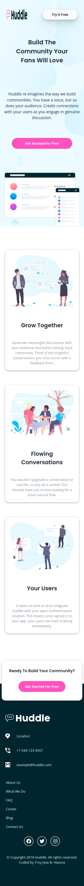
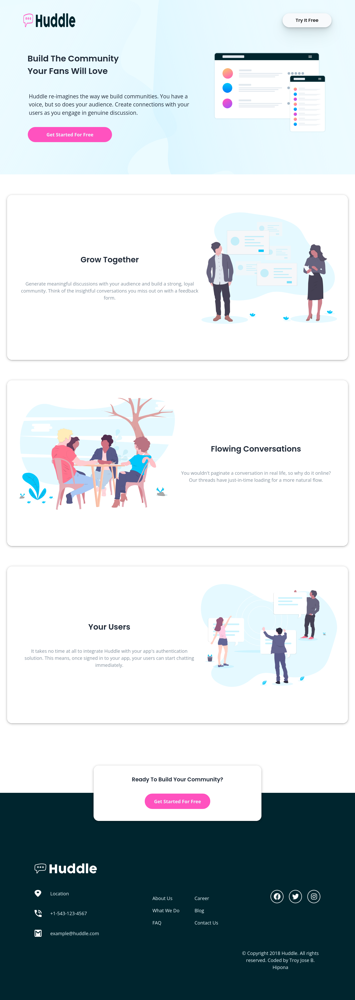

# Frontend Mentor - Huddle landing page with alternating feature blocks solution

This is a solution to the [Huddle landing page with alternating feature blocks challenge on Frontend Mentor](https://www.frontendmentor.io/challenges/huddle-landing-page-with-alternating-feature-blocks-5ca5f5981e82137ec91a5100). Frontend Mentor challenges help you improve your coding skills by building realistic projects. 

## Table of contents

- [Overview](#overview)
  - [The challenge](#the-challenge)
  - [Screenshot](#screenshot)
  - [Links](#links)
- [My process](#my-process)
  - [Built with](#built-with)
  - [What I learned](#what-i-learned)
  - [Continued development](#continued-development)
  - [Useful resources](#useful-resources)
- [Author](#author)
- [Acknowledgments](#acknowledgments)

## Overview

This challenge is perfect if you're wanting to practice your layout skills. If you're starting to get a bit more confident laying out a web page, give this project a go.

### The challenge

Users should be able to:

- View the optimal layout for the site depending on their device's screen size
- See hover states for all interactive elements on the page

### Screenshot





### Links

- Solution URL: (https://github.com/troy03/huddle-landing-page-with-alternating-feature-blocks)
- Live Site URL: (https://troy03.github.io/huddle-landing-page-with-alternating-feature-blocks/)

## My process

  My process was to relearn about flexbox and start to mobile first and after that I apply the active state.

### Built with

- Semantic HTML5 markup
- CSS custom properties
- Flexbox
- Mobile-first workflow

### What I learned

According to MDN the filter CSS property applies graphical effects like blur or color shift to an element. Filters are commonly used to adjust the rendering of images, backgrounds, and borders. I apply this on the logo of Huddle Page in the footer section.


```css
.social__icon {
  filter: brightness(0) invert(1);    
  padding: 0.625rem;
  border-radius: 100%;
  border: 2px solid #fff;
  height: 2.8125em;
  width: 2.8125em;
  transition: filter 600ms ease-in;
}

.social__icon:hover {
  filter: invert(46%) sepia(49%) saturate(2128%) hue-rotate(295deg) brightness(102%) contrast(101%);
  cursor: pointer
}
```

### Continued development

For the future, going to learn about animation in CSS and apply for this project

### Useful resources

- [CSS Tricks](https://www.google.com/url?sa=t&source=web&cd=&cad=rja&uact=8&ved=2ahUKEwjh88L21rT7AhWXHnAKHTcwCKEQFnoECCQQAQ&url=https%3A%2F%2Fcss-tricks.com%2Falmanac%2Fproperties%2Ff%2Ffilter%2F&usg=AOvVaw2jlca-Em_YWZHda3C_emGF) - This help me on how I change the color of the background image.

## Author

- Frontend Mentor - [@troy03](https://www.frontendmentor.io/profile/troy03)
- Twitter - [@troy03](https://github.com/troy03)

**Note: Delete this note and add/remove/edit lines above based on what links you'd like to share.**

## Acknowledgments

Thank you for Frontendmentor for this awesome challenge.
